# 🛡️ Ambient Expense Agent

An event-driven, ambient expense-approval agent built using the **ADK 2.0 Graph Workflow API** and deployed to **Vertex AI Agent Runtime**. 

It features an asynchronous Pub/Sub ingestion pipeline, automated branching rules, and an elegant, secure manager dashboard hosted on **Cloud Run** for human-in-the-loop decisions.

---

## 📊 System Architecture

The following diagram visualizes the end-to-end event-driven flow of the expense approval pipeline:

```mermaid
sequenceDiagram
    autonumber
    actor Submitter
    participant PubSub as Pub/Sub Topic<br/>(expense-reports)
    participant Subscription as Push Subscription<br/>(expense-reports-push)
    participant AgentRuntime as Agent Runtime<br/>(Vertex AI)
    participant SessionService as Session Service<br/>(Vertex AI)
    participant Dashboard as Manager Dashboard<br/>(Cloud Run)
    actor Manager

    Submitter->>PubSub: Publish Expense Report
    PubSub->>Subscription: Decouple & forward
    Subscription->>AgentRuntime: POST :query (raw payload)
    
    rect rgb(20, 25, 35)
        note right of AgentRuntime: Agent Workflow execution
        alt Amount < $100
            AgentRuntime-->>Subscription: Auto-Approve (200 OK)
        else Amount >= $100
            AgentRuntime->>SessionService: Persist paused session state
            AgentRuntime-->>Subscription: Yield RequestInput & Pause (200 OK)
        end
    end

    loop Dynamic Polling
        Dashboard->>SessionService: GET /api/pending (list & fetch sessions)
        SessionService-->>Dashboard: Return unresolved adk_request_input
    end
    
    Dashboard->>Manager: Render pending cards on Dashboard UI
    Manager->>Dashboard: Click Approve / Reject
    Dashboard->>AgentRuntime: POST :query (resume payload with OIDC token)
    AgentRuntime->>SessionService: Retrieve session state & resume
    AgentRuntime->>AgentRuntime: Record final outcome
    AgentRuntime->>SessionService: Update session state (complete)
    AgentRuntime-->>Dashboard: Complete execution
```



---

## 📂 Project Structure

```
ambient-expense-agent/
├── expense_agent/         # Core agent code
│   ├── agent.py               # Workflow graph logic, nodes, and schemas
│   ├── fast_api_app.py        # Local FastAPI Backend serving Pub/Sub on port 8080
│   ├── config.py              # Configuration tokens (thresholds, model names)
│   └── app_utils/             # App utilities and helpers
├── submission_frontend/   # Standalone Manager Dashboard service (FastAPI + HTML)
│   ├── templates/
│   │   └── dashboard.html         # Premium glassmorphic UI dashboard
│   ├── main.py                # FastAPI endpoints for listing/resuming sessions
│   └── Dockerfile             # Dockerfile for Cloud Run deployment
├── tests/                     # Unit and integration tests
├── Makefile                   # Local task runner
└── pyproject.toml             # Project dependencies and configurations
```

---

## ⚙️ Workflow Routing Rules

1. **Auto-Approve (< $100)**: Expenses under $100 are auto-approved instantly with no LLM involvement.
2. **Human-in-the-Loop & LLM Risk Assessment (>= $100)**:
   * **Pause First**: The workflow immediately pauses at the `human_review` node, yielding a `RequestInput` and saving state in the Session Service.
   * **Dashboard Alert**: The pending approval appears on the manager dashboard.
   * **LLM Analysis After Approval**: Once the manager approves, the workflow resumes, routes to the `risk_analyzer` (`gemini-2.5-flash` LLM) to perform the risk assessment, and outputs the analysis to the conversation log before recording the final outcome.

---

## 🚀 Production Deployment

### 1. Deploy the Agent to Vertex AI Agent Runtime
Deploy the agent code to Google Cloud:
```bash
agents-cli deploy --project YOUR_PROJECT_ID
```
* **Deployed Location**: `us-central1`
* **Agent Runtime ID**: `projects/YOUR_PROJECT_NUMBER/locations/us-central1/reasoningEngines/YOUR_ENGINE_ID`

### 2. Set Up the Pub/Sub Event Pipeline
Create the topics and the push subscription pointing directly to the Agent Runtime `:query` REST API:

```bash
# Create topics
gcloud pubsub topics create expense-reports --project=YOUR_PROJECT_ID
gcloud pubsub topics create expense-reports-dead-letter --project=YOUR_PROJECT_ID

# Create service account for Pub/Sub push authentication
gcloud iam service-accounts create pubsub-invoker --display-name="Pub/Sub Invoker Service Account" --project=YOUR_PROJECT_ID

# Grant invocation permissions
gcloud projects add-iam-policy-binding YOUR_PROJECT_ID \
    --member="serviceAccount:pubsub-invoker@YOUR_PROJECT_ID.iam.gserviceaccount.com" \
    --role="roles/aiplatform.user"

# Allow Pub/Sub to generate tokens using the service account
gcloud iam service-accounts add-iam-policy-binding pubsub-invoker@YOUR_PROJECT_ID.iam.gserviceaccount.com \
    --member="serviceAccount:service-YOUR_PROJECT_NUMBER@gcp-sa-pubsub.iam.gserviceaccount.com" \
    --role="roles/iam.serviceAccountTokenCreator" \
    --project=YOUR_PROJECT_ID

# Grant dead-letter publishing permissions
gcloud pubsub topics add-iam-policy-binding expense-reports-dead-letter \
    --member="serviceAccount:service-YOUR_PROJECT_NUMBER@gcp-sa-pubsub.iam.gserviceaccount.com" \
    --role="roles/pubsub.publisher" \
    --project=YOUR_PROJECT_ID

# Create the push subscription
gcloud pubsub subscriptions create expense-reports-push \
    --topic=expense-reports \
    --push-endpoint="https://us-central1-aiplatform.googleapis.com/v1/projects/YOUR_PROJECT_NUMBER/locations/us-central1/reasoningEngines/YOUR_ENGINE_ID:query" \
    --push-no-wrapper \
    --push-auth-service-account="pubsub-invoker@YOUR_PROJECT_ID.iam.gserviceaccount.com" \
    --push-auth-token-audience="https://us-central1-aiplatform.googleapis.com/v1/projects/YOUR_PROJECT_NUMBER/locations/us-central1/reasoningEngines/YOUR_ENGINE_ID:query" \
    --ack-deadline=600 \
    --dead-letter-topic=expense-reports-dead-letter \
    --max-delivery-attempts=5 \
    --project=YOUR_PROJECT_ID

# Grant acknowledgment permissions
gcloud pubsub subscriptions add-iam-policy-binding expense-reports-push \
    --member="serviceAccount:service-YOUR_PROJECT_NUMBER@gcp-sa-pubsub.iam.gserviceaccount.com" \
    --role="roles/pubsub.subscriber" \
    --project=YOUR_PROJECT_ID
```

### 3. Deploy the Manager Dashboard to Cloud Run
Deploy the `submission_frontend` service to Cloud Run:
```bash
gcloud run deploy expense-manager-dashboard \
    --source submission_frontend \
    --region us-central1 \
    --allow-unauthenticated \
    --set-env-vars GOOGLE_CLOUD_PROJECT=YOUR_PROJECT_ID,AGENT_RUNTIME_ID=projects/YOUR_PROJECT_NUMBER/locations/us-central1/reasoningEngines/YOUR_ENGINE_ID
```

Grant the dashboard's runtime service account permissions to invoke and query reasoning engine sessions:
```bash
gcloud projects add-iam-policy-binding YOUR_PROJECT_ID \
    --member="serviceAccount:YOUR_PROJECT_NUMBER-compute@developer.gserviceaccount.com" \
    --role="roles/aiplatform.user"
```

---

## 🧪 Testing and Verification

### 1. Test Auto-Approval (< $100)
Publish a `$50` expense to the Pub/Sub topic:
```bash
gcloud pubsub topics publish expense-reports \
    --message='{"input": {"user_id": "default-user", "message": "{\"amount\": 50.0, \"submitter\": \"user@example.com\", \"category\": \"meals\", \"description\": \"Lunch\", \"date\": \"2026-06-04\"}"}, "class_method": "query"}' \
    --project=YOUR_PROJECT_ID
```
This will be auto-approved instantly with no manual intervention.

### 2. Test Human-in-the-Loop (>= $100)
Publish a `$150` expense:
```bash
gcloud pubsub topics publish expense-reports \
    --message='{"input": {"user_id": "default-user", "message": "{\"amount\": 150.0, \"submitter\": \"user@example.com\", \"category\": \"meals\", \"description\": \"Client dinner\", \"date\": \"2026-06-04\"}"}, "class_method": "query"}' \
    --project=YOUR_PROJECT_ID
```
* The push subscription delivers the payload to Agent Runtime, which pauses the execution.
* Open the **Manager Dashboard** URL. The card will appear in the pending list.
* Click **Approve** or **Reject**. The dashboard will securely resume the session on Agent Runtime, trigger the LLM risk assessment, and finalize the outcome.
