# 🛡️ Ambient Expense Agent: Event-Driven Expense Management with Human-in-the-Loop AI

**Subtitle**: A Secure, Asynchronous, and Event-Driven Expense Approval Pipeline Deployed on Google Cloud using the Vertex AI Agent Development Kit (ADK)  
**Track**: Agents for Business  
**Authors**: Sak245  
**Project Link**: [github.com/Sak245/ambient-expense-agent-kaggle-google](https://github.com/Sak245/ambient-expense-agent-kaggle-google)  
**Video Demo**: [Insert Your YouTube Video Link]  

---

## 📝 Abstract

Traditional corporate expense management is plagued by manual overhead, delayed approvals, and a lack of real-time risk intelligence. Managers are fatigued by low-value approvals, while high-value expenses often bypass rigorous scrutiny. 

**Ambient Expense Agent** is a production-ready, event-driven AI agent system that automates the ingestion, routing, human approval, and risk analysis of corporate expenses. Built using the **ADK 2.0 Graph Workflow API**, the agent processes expenses asynchronously via a **Google Cloud Pub/Sub** push pipeline. It auto-approves low-value expenses (< $100) and intelligently pauses for high-value expenses (>= $100) to request human intervention. 

A premium glassmorphic manager dashboard hosted on **Cloud Run** enables real-time approvals, which securely resumes the agent workflow on **Vertex AI Agent Runtime** to perform a deep LLM-based risk assessment using `gemini-2.5-flash`.

---

## ❓ Problem Statement

In modern enterprises, expense approval workflows suffer from three major pain points:
1. **Approval Bottlenecks**: High-volume, low-risk expenses (e.g., $15 lunches) require manual sign-off, wasting valuable manager time.
2. **Static Routing**: Existing rules-based software cannot dynamically assess context (e.g., whether "Client dinner" justifies a $150 charge) without rigid, hardcoded policies.
3. **Lack of Human-in-the-Loop (HITL) Integration**: Fully autonomous AI agents are too risky for financial transactions, yet building secure, real-time human intervention points into async agent workflows is highly complex.

Our goal was to build an **ambient (invisible) agent** that runs continuously in the background, ingesting events from financial systems, automating low-value tasks, and seamlessly looping in managers only when financial risk thresholds are crossed.

---

## ⚙️ Solution & Value Proposition

The **Ambient Expense Agent** addresses these challenges through a three-tiered architecture:
* **Asynchronous Event Ingestion**: The agent does not wait for user interaction; it is triggered "ambiently" by incoming Pub/Sub messages representing transactions.
* **Intelligent Branching**: High-volume, low-risk expenses are auto-approved in milliseconds. High-risk expenses are paused.
* **Secure Human-in-the-Loop (HITL)**: A dedicated, secure manager dashboard displays pending approvals. Once approved, the agent resumes execution to perform a context-aware LLM risk assessment using Gemini.

This hybrid approach ensures **zero friction** for low-risk transactions, **robust security** for high-risk transactions, and **intelligent risk mitigation** driven by generative AI.

---

## 🏗️ System Architecture & Data Flow

The system consists of three main components:
1. **The ADK Workflow Graph**: Deployed to Vertex AI Agent Runtime.
2. **The Pub/Sub Event Pipeline**: Ingests and routes transactions.
3. **The Manager Dashboard**: A serverless Cloud Run frontend.

```mermaid
sequenceDiagram
    autonumber
    actor Submitter
    participant PubSub as Pub/Sub Topic<br/>(expense-reports)
    participant Subscription as Push Subscription<br/>(expense-reports-push)
    participant AgentRuntime as Agent Runtime<br/>(Vertex AI)
    participant SessionService as Session Service<br/>(Vertex AI)
    participant Dashboard as Manager Dashboard<br/>(Cloud Run)
    actor Manager

    Submitter->>PubSub: Publish Expense Report
    PubSub->>Subscription: Decouple & forward
    Subscription->>AgentRuntime: POST :query (raw payload)
    
    rect rgb(20, 25, 35)
        note right of AgentRuntime: Agent Workflow execution
        alt Amount < $100
            AgentRuntime-->>Subscription: Auto-Approve (200 OK)
        else Amount >= $100
            AgentRuntime->>SessionService: Persist paused session state
            AgentRuntime-->>Subscription: Yield RequestInput & Pause (200 OK)
        end
    end

    loop Dynamic Polling
        Dashboard->>SessionService: GET /api/pending (list & fetch sessions)
        SessionService-->>Dashboard: Return unresolved adk_request_input
    end
    
    Dashboard->>Manager: Render pending cards on Dashboard UI
    Manager->>Dashboard: Click Approve / Reject
    Dashboard->>AgentRuntime: POST :query (resume payload with OIDC token)
    AgentRuntime->>SessionService: Retrieve session state & resume
    AgentRuntime->>AgentRuntime: Record final outcome
    AgentRuntime->>SessionService: Update session state (complete)
    AgentRuntime-->>Dashboard: Complete execution
```



---

## 🎓 Key Course Concepts Applied

We integrated three core concepts from the **Kaggle 5-Day AI Agents Course**:

### 1. Agent Workflow System (ADK)
We utilized the **ADK Graph Workflow API** to model our business logic as a directed graph. This allows for complex state management, conditional routing, and structured interrupts:
* **Nodes**:
  - `parse_expense`: Validates and parses the incoming transaction payload.
  - `route_expense`: A routing node that branches based on the expense amount.
  - `auto_approve`: Handles instant approvals for low-value expenses.
  - `human_review`: An asynchronous generator node that yields a `RequestInput` (interrupt) and pauses.
  - `risk_analyzer`: An `LlmAgent` node that performs context-aware risk analysis.
  - `record_outcome`: Records and logs the final approval state.
* **Edges**:
  ```python
  edges=[
      (START, parse_expense),
      (parse_expense, route_expense),
      (route_expense, {"auto_approve": auto_approve, "llm_review": human_review}),
      (human_review, {"approved": risk_analyzer, "rejected": record_outcome}),
      (risk_analyzer, record_outcome),
      (auto_approve, record_outcome),
  ]
  ```

### 2. Security Features (IAM & OIDC)
Financial workflows demand strict security. We implemented a **zero-trust** security model on Google Cloud:
* **OIDC Authentication for Pub/Sub**: The Pub/Sub push subscription is configured with an OIDC token audience. Only authorized Pub/Sub push requests carrying valid Google-signed OIDC tokens can invoke the Agent Runtime.
* **Least-Privilege IAM**: 
  - The Pub/Sub service account is granted only `roles/aiplatform.user` on the specific reasoning engine.
  - The Cloud Run dashboard runs under a dedicated service account with restricted access to the Vertex AI Session Service, preventing unauthorized session manipulation.
* **Structured Decision Schema**: The `human_review` node enforces a strict Pydantic schema (`HumanDecision`) for the interrupt response, preventing injection attacks or malformed inputs from resuming the workflow.

### 3. Deployability & Agent Skills
We used **`agents-cli`** to scaffold and package the application:
* Deployed the agent as a **Vertex AI Reasoning Engine** (`Agent Runtime`), which automatically provides a managed serverless environment, autoscaling, and built-in session state persistence.
* Leveraged the `VertexAiSessionService` API within our custom dashboard to list, inspect, and resume active agent sessions programmatically.

---

## 🛠️ Technical Decisions & Implementation Highlights

### 1. Human-in-the-Loop Before AI Analysis (Cost Efficiency)
In early designs, we ran the LLM risk assessment *before* the manager approved. We optimized this order to **Human-in-the-Loop First**. The agent immediately pauses upon receiving a high-value expense. Only if the manager clicks **Approve** does the agent invoke the `gemini-2.5-flash` model. This design:
- Saves significant LLM token costs by avoiding analysis on expenses that are ultimately rejected by managers.
- Speeds up the initial ingestion path.

### 2. Overcoming the Resume Replay Constraint
A key technical challenge arose when resuming the paused workflow: the ADK runner fast-forwards completed or paused nodes by default. Since `human_review` was paused, resuming it resulted in a `None` route, causing the workflow to terminate.

We solved this by utilizing the `@node` decorator's `rerun_on_resume` parameter:
```python
@node(rerun_on_resume=True)
async def human_review(ctx: Context, node_input: Any):
    # If decision is present in resume_inputs, process it and yield the route!
    if ctx.resume_inputs and "decision" in ctx.resume_inputs:
        decision = ctx.resume_inputs["decision"]
        approved = decision in ["yes", "approve", "approved"]
        yield Event(
            output=node_input,
            actions=EventActions(route="approved" if approved else "rejected", state_delta=state_delta)
        )
```
Setting `rerun_on_resume=True` guarantees that the node re-executes upon resumption, reads the manager's decision, and emits the correct route (`"approved"` or `"rejected"`) to transition the graph.

---

## 📈 E2E Verification & Results

We verified the pipeline end-to-end:
1. **Low-risk Ingestion**: A `$50` expense published to the Pub/Sub topic was auto-approved in **under 200ms**.
2. **High-risk Ingestion**: A `$150` expense ("Client dinner") was published. The agent successfully paused and created a pending session.
3. **Manager Dashboard**: The dashboard detected the pending session and rendered a card.
4. **Approval & Resumption**: Clicking **Approve** resumed the session. The agent executed the `risk_analyzer` LLM, which outputted a structured low-risk assessment, and successfully recorded the approved outcome.

---

## 🔮 Future Work

* **Multi-Agent Risk Audit**: Introduce a secondary auditor agent that cross-references invoices uploaded via OCR with historical employee spending patterns.
* **Slack/Teams Integration**: Deliver pending approval alerts directly to chat platforms using Slack interactive buttons, allowing managers to approve without leaving their chat workspace.
* **Proactive Anomaly Detection**: Train a lightweight model to flag suspicious patterns before they reach the LLM, reducing false positives.
